# Exemplo de um Projeto C++ Cross-Platform no Visual Studio Code

Exemplo de um projeto C++ configurado no Visual Studio Code que compila para as arquiteturas x86 e x64 nos Sistemas Operacionais Windows e Linux.

Esse projeto contém apenas um aquivo c++, o propósito do projeto é servir como ponto de partida para configurações mais complexas, com mais arquivos, ou com bibliotecas externas, etc.

## Instalação

Caso não tenha, baixe e instale o Git [aqui](https://git-scm.com/).

Clone o projeto com o comando abaixo:
```bash
git clone https://github.com/joaops/HelloWorld.git HelloWorld
```

Prosiga para a próxima etapa.

## Configuração dos Ambientes de Desenvolvimento

Antes de mais nada, é preciso primeiro configurar os ambientes de desenvolvimento.

O Primeiro passo é instalar o Visual Studio Code, o download pode ser feito pelo [site](https://code.visualstudio.com/).

Após instalar, é necessário abrir o VS Code e instalar a extenção do [C/C++](https://marketplace.visualstudio.com/items?itemName=ms-vscode.cpptools).

Por fim, siga a configuração de acordo com o seu ambiente de desenvolvimento.

### Windows x64

Acesse o site [MSYS2](https://www.msys2.org/) e baixe o instalador.

Execute o instalador.

Escolha o local de instalação:


No final, marque a opção `Run MSYS2 64bit now`.

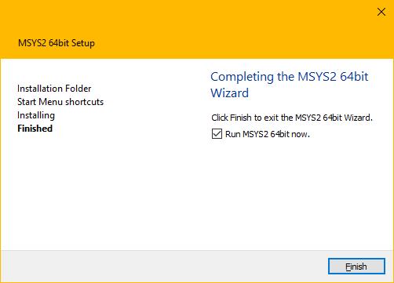

No terminal do MSYS2, execute o seguinte comando:
```bash
$ pacman -Syu
```

Confirme o comando digitando `Y`.

Abra novamente o Terminal do MSYS2 pelo Menu Iniciar:

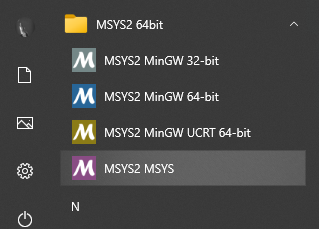

Execute o seguinte comando para atualizar os pacotes básicos:

```bash
$ pacman -Su
```

Confirme o comando digitando `Y`.

Faça a inslação do MinGW 64-bit com o seguinte comando:
```bash
$ pacman -S --needed base-devel mingw-w64-x86_64-toolchain
```

Confirme o comando digitando `Y`.

No Menu Iniciar, digite `variáveis de ambiente`, clique no botão `Variáveis de Ambiente...` e localize as `Variáveis do sistema`.

Edite a variável `Path` e adicione o diretório `C:\msys64\mingw64\bin` no final dessa lista.

> Caso você tenha escolhido um diretório diferente para a instalação, lembre de atualizar a variável `Path` e os arquivos de configuração que estão dentro da pasta `.vscode`.

> Para gerar o executável usando o VS Code, é necessário que o diretório esteja configurado na variável Path.

### Windows x86

Acesse o site [MSYS2](https://www.msys2.org/) e baixe o instalador.

Execute o instalador.

Escolha o local de instalação:


No final, marque a opção `Run MSYS2 64bit now`.


No terminal do MSYS2, execute o seguinte comando:
```bash
$ pacman -Syu
```

Confirme o comando digitando `Y`.

Abra novamente o Terminal do MSYS2 pelo Menu Iniciar:


Execute o seguinte comando para atualizar os pacotes básicos:

```bash
$ pacman -Su
```

Confirme o comando digitando `Y`.

Faça a inslação do MinGW 86-bit com o seguinte comando:
```bash
$ pacman -S --needed base-devel mingw-w64-i686-toolchain
```

Confirme o comando digitando `Y`.

No Menu Iniciar, digite `variáveis de ambiente`, clique no botão `Variáveis de Ambiente...` e localize as `Variáveis do sistema`.

Edite a variável `Path` e adicione o diretório `C:\msys64\mingw32\bin` no final dessa lista.

> Caso você tenha escolhido um diretório diferente para a instalação, lembre de atualizar a variável `Path` e os arquivos de configuração que estão dentro da pasta `.vscode`.

> Para gerar o executável usando o VS Code, é necessário que o diretório esteja configurado na variável Path.

### Windows x64 e x86

Para manter as duas configurações, adiciones ambos diretórios nas variáveis de ambiente da seguinte forma:

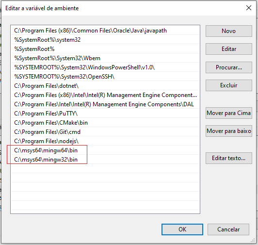

Manter a configuração x64 antes da x86, faz com que a x64 seja executada antes da x86 no Prompt de Comando.

Por exemplo:

```bash
g++ -v
```

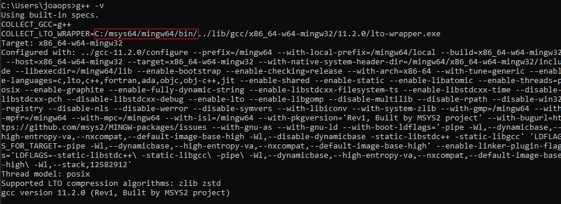

Isso não interfere em nada ao fazer o build pelo VS Code, pois os diretórios também estão configurados em cada task.

> Para gerar o executável usando o VS Code, é necessário que os diretórios estejam configurados na variável Path.

### Linux x64

Verifique se você tem o GCC, G++ e o GDB instalado com os comandos:

```bash
gcc -v
g++ -v
gdb -v
```

Caso você não tenha, execute os seguintes comandos:

```bash
sudo apt-get update
sudo apt-get install build-essential gdb
```

### Linux x86

Verifique se você tem o GCC, G++ e o GDB instalado com os comandos:

```bash
gcc -v
g++ -v
gdb -v
```

Caso você não tenha, execute os seguintes comandos:

```bash
sudo apt-get update
sudo apt-get install build-essential gdb
```

Para poder compilar com a flag `-m32`, é necessário instalar o GCC-multilib e o G++-multilib.

Execute os seguintes comandos:
```bash
sudo apt-get install gcc-multilib
sudo apt-get install g++-multilib
```

## Compilando

Abra o arquivo `main.cpp` no VS Code e mantenha ele como o arquivo ativo no Editor, pois é ele que desejamos compilar, ao selecionar um arquivo diferente, o VS Code irá compilar esse outro arquivo.

Selecione a configuração para o tipo de compilação que você deseja.

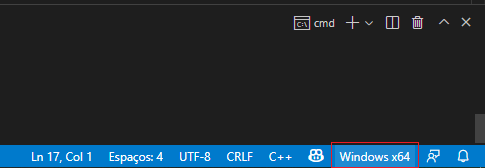

Por fim, aperte `Ctrl + Shift + B` para abrir o menu de compilação e escolha a `task` para compilar.

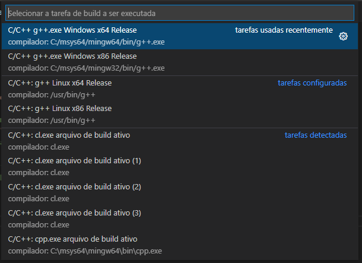

Caso tenha ocorrido tudo certo, você verá a seguinte mensagem:

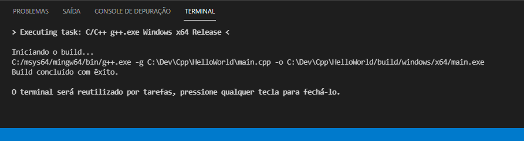

E o arquivo `main.exe` será gerado no seguinte diretório:

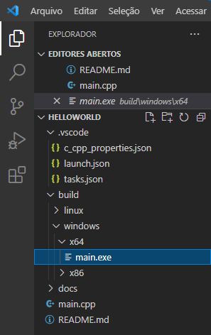

Você pode executar o arquivo `main.exe` com o comando:

```bash
build\windows\x64\main.exe
```

Para ver o seguinte resultado:

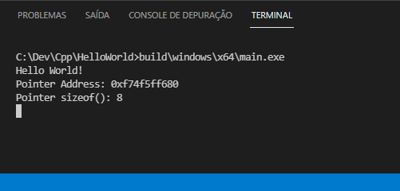

## Debugando

Abra o arquivo `main.cpp` e mantenha ele como o arquivo ativo no Editor.

Altere o VS Code para o modo de Debug.

Para isso, aperte `Ctrl + Shift + D`, ou clique no ícone de Debug.


Em seguida, escolha qual das configurações você deseja debugar.

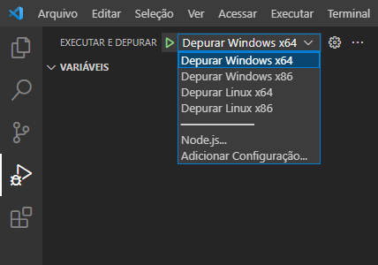

Então procione `F5` para iniciar o Debug, ou clique no botão para iniciar o Debug.

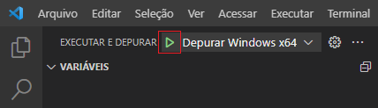

Ao executar o Debug, é possível ver os arquivos dlls que são carregados pelo VS Code.

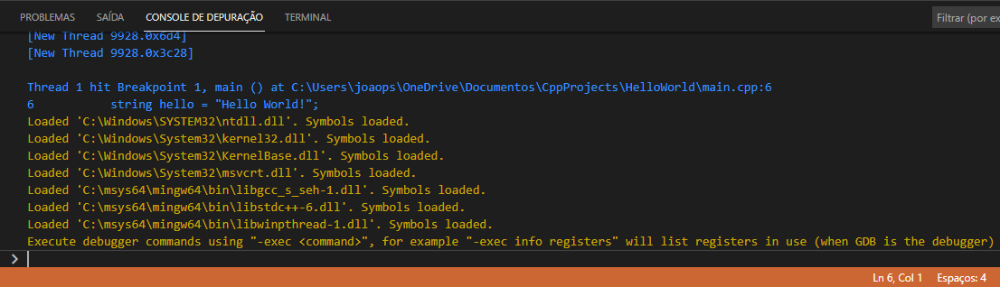

Esses arquivos são necessários para que o programa funcione, sem eles o programa não irá executar.

Como foi instalado o MinGW nesse computador e foi configurado as variáveis de ambiente, o VS Code irá carregar os arquivos dlls a partir do diretório `C:\msys64\mingw64\bin\`.

Você pode copiar essas dlls para o diretório do executável, assim ao invés de carregá-las a partir do diretório do MinGW, elas serão carregadas localmente.

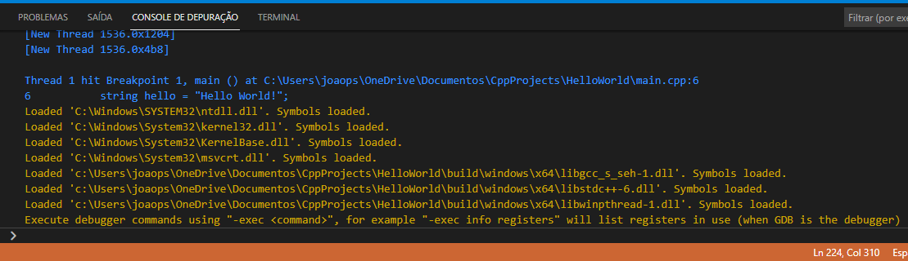

Dessa forma, o programa pode ser executado em qualquer computador, sem a necessidade de instalar ou configurar o MinGW.

Não é necessário copiar as dlls do System32, pois elas fazer parte do Windows.

## Links Úteis

https://code.visualstudio.com/docs/cpp/config-mingw

https://www.msys2.org/

https://stackoverflow.com/questions/51724007/msys2-install-gcc-or-toolchain